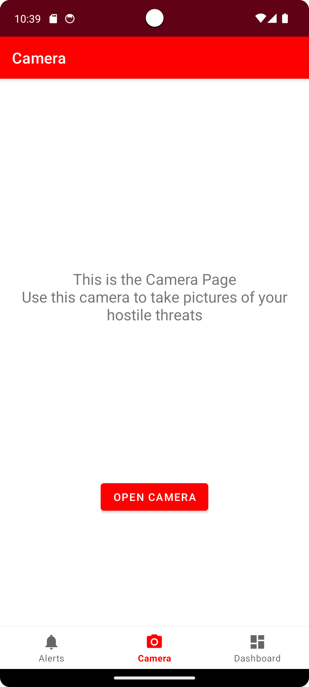
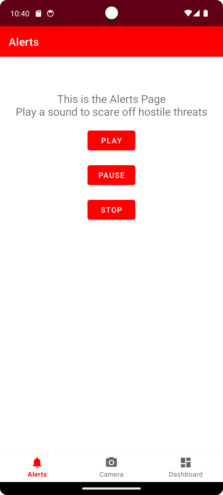
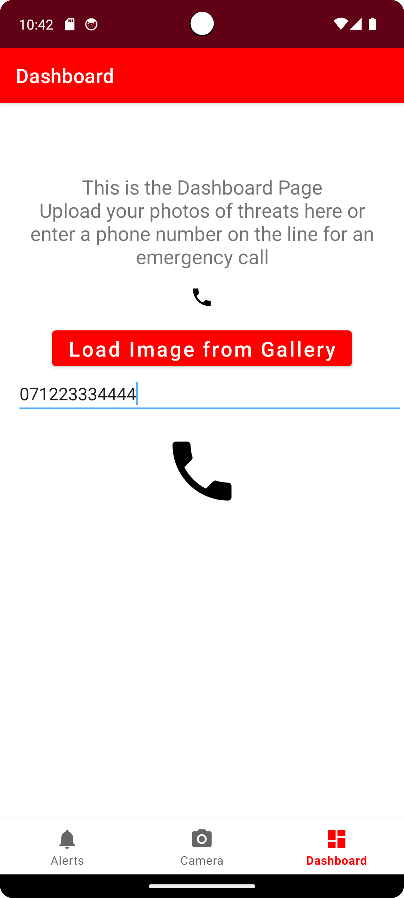
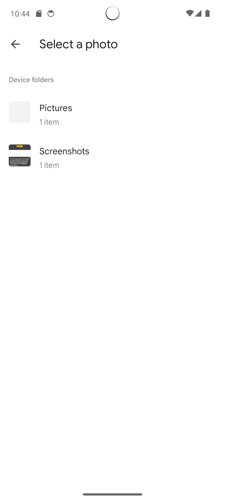

Readme.md

--App Description--

Developer name: Cameron Carter
Student number: 2005572

App name: Security

Summary: Used for self defence when approached by a threat

The app functionalities include a navigation bar, more than three interlinking pages (without including a login page), camera integration, image uploader from gallery, phone speaker integration, phone calling integration, use of widgets to obtain input from the user but also to display information to the user in an easy to understand manner all with professional coding standards maintained throughout. 

--Details of app design--

Navigation on the app is very simple to use as the nav bar is clearly present and visible on the three main pages and you can easily switch back and forth between them. All pages are labelled with name, their own icon and even have user feedback when pressed such as lighting up and playing responsive audio. 

Widgets on all the app’s pages are very user friendly and easy to follow. 
The Home page has a button that will open up the camera app on the android. 
The alerts page has 3 buttons that will play, pause and completely stop the mp3 sound and the dashboard page has a phone call button that once pressed after a phone number is put in, will use the android’s phone to make a call. 
The dashboard also has a button that will open up the phone's gallery to see your images. 
Through all of this, numerous mobile functionalities have been implemented.

--Reflective Statement--

Android Studio was a very simple and enjoyable application to use in my opinion. The layout was easy to understand and the software felt responsive.

For future plans I would continue the project by making separate pages for phone calls and the image uploader from the gallery. For the phone page I would allow the user to store multiple specific phone numbers with widgets which would allow for a faster dial. For the image uploader page I would allow multiple photos to be stored at once so the user could see if the animal or person has approached them before. 
 
Learning from this experience, going forward I will allow myself more time to finish everything I planned to do and also allow for time to make things more professional and allow for even better user ability.

